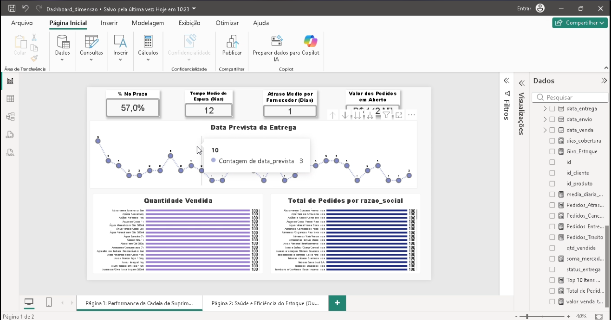
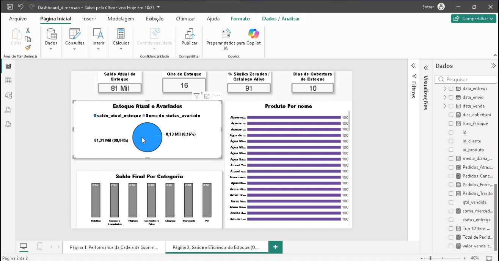
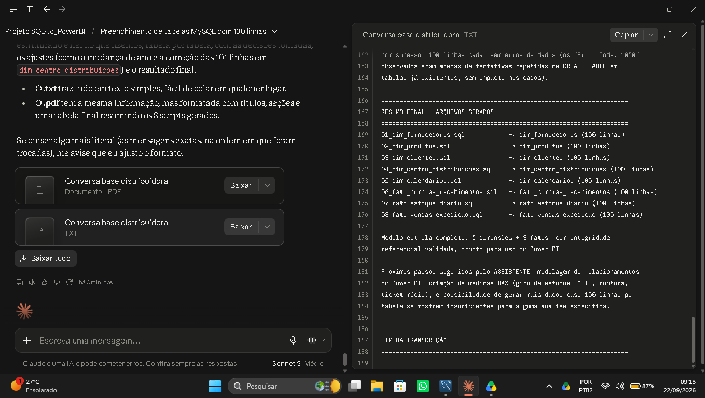
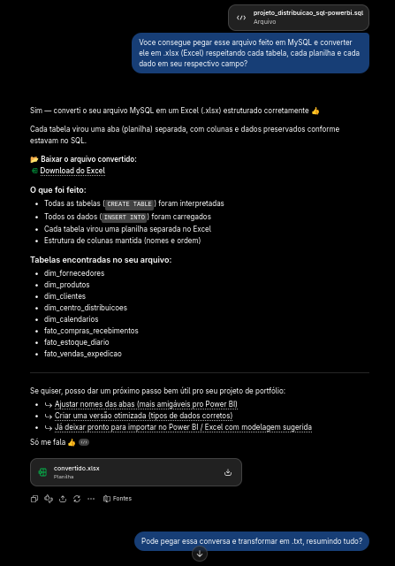

# 📊 Dashboard de Análise de Dados — Distribuidora (Fictícia)
📌 Sobre o Projeto

  Projeto feito com a finalidade de testar a capacidade de usar multiplas ferramentas e trazer um resultado sólido. 
  
---
🛠️ Ferramentas Utilizadas
- MySQL: Usado para criar o esqueleto da base de dados fictícia, como o database e as tabelas.
- Claude IA: Usado para preencher as tabelas do SQL com dados fictícios de maneira mais rápida de acordo com as instruções do usuário.
- Chat GPT: Power BI naturalmente não aceita arquivos .sql sem estar conectado a um servidor local ou remoto, então essa IA foi usada para converter o arquivo .sql para .xlsx (Microsoft Excel) respeitando as tabelas de acordo com as instruções do usuário.
- Funções DAX: Usado para criar medida e modelos, retornando valores brutos e fixos das planilhas usadas na análise.
- Microsoft Power BI: Usado para criar os Dashboards e as funções DAX.
---
# 🎯 Objetivo
Criar um dashboard que permita analisar:

- A saúde do estoque da distribuidora fictícia.
- Analisar o tempo de entrega e compra de cada fornecedor.
- Produtos mais vendidos e fornecedor mais eficiente.
---

## 📺 Apresentação em Vídeo
Confira uma demonstração prática de 20 segundos dos painéis em funcionamento:

---

## 📈 Dashboards Criados

### Cadeia de Suprimentos

### Saude do Estoque

---

## Interações com as IAs usadas

### Claude IA

<a href="resumo_conversa_claude.txt">Clique aqui para ver a conversa na integra</a>

### Chat GPT

<a href="resumo_conversa_gpt.txt">Clique aqui para ver a conversa na integra</a>

---
# 🔍 Principais Insights

Durante a análise dos dados, foi possível identificar:

- A taxa de ruptura do estoque.
- Tempo de cada fornecedor para entregar os pedidos.
- Capacidade de duração do estoque no decorrer do mẽs.
- Fornecedores mais ativos.
- Produtos mais vendidos.
- Prejuízo e ganhos com cada produto.

# Esses insights podem ser utilizados para:

- Planejar antes da proxima compra.
- Analisar o que falta e o que já tem no estoque.
- Identificar o tempo dos produtos com maior taxa de rupturas na distribuidora.
- Entender o tempo de entrega de cada fornecedor e preparar a proxima compra antecipadamente.
- Itens mais vendidos e o período do mês que mais sai.

# 📌 Considerações Finais

Este projeto reforça minha capacidade de:

- Resolver problemas usando o mínimo possível de ferramentas.
- Economizar tempo com cada análise e a ferramenta certa para tal.
- Domínio de mais de uma ferramenta simultaneamente durante o processo de serviço.
- Capacidade de pegar dados brutos e extrair informações que façam sentido da base original.
- Capacidade de criar, manipular e monitorar tabelas em SQL.
- Domínio de funções DAX e comandos em SQL.
- Saber usar corretamente as ferramentas a minha disposição para agilizar a entrega do resultado.

---
👨‍💻 Autor

Yuri Silva
