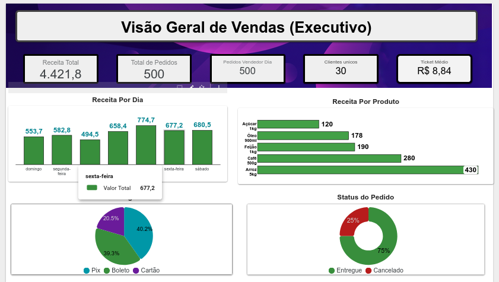
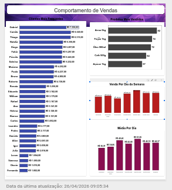
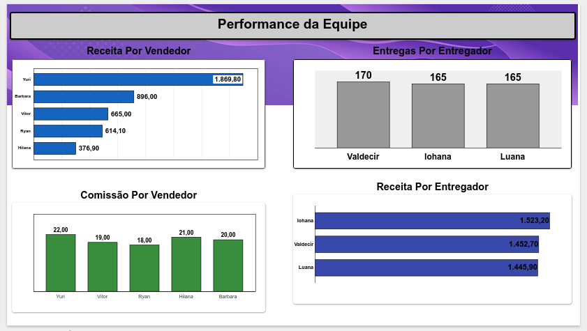

# 📊 Projeto de Análise de Dados: E-commerce

Este projeto apresenta uma análise completa de uma base de dados de E-commerce, abrangendo desde a manipulação dos dados brutos até a criação de painéis estratégicos e interativos.

## 🛠️ Ferramentas Utilizadas
* **Google Sheets**: Limpeza, tratamento e manipulação da base de dados.
* **Looker Studio**: Construção dos 3 dashboards integrados.

---

## 📺 Apresentação em Vídeo
Confira uma demonstração prática de 30 segundos dos painéis em funcionamento:

<video src="Apresentação dos 3 em práticas.mp4" width="100%" controls></video>

---

## 📈 Dashboards Criados

### 1. Visão Geral de Vendas

### 2. Comportamento de Vendas

### 3. Performance da Equipe

---

## 🔗 Links Úteis
* [Acesse o Dashboard Interativo no Looker Studio](COLE_O_LINK_DO_LOOKER_STUDIO_AQUI)
* A base de dados editada pode ser encontrada no arquivo `_vendas_ecommerce_editavel.csv` nesta pasta.
